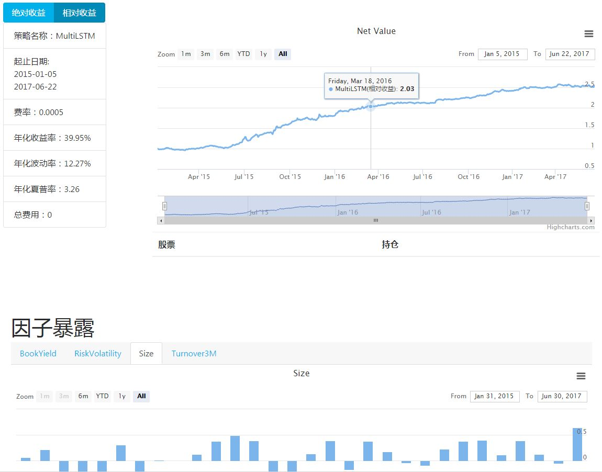

策略回测
********

..  currentmodule:: quant.backtest

起步
####

一个简单的股票回测程序只需要继承一个抽象策略类，定义一个选股策略就可以，一个简单的例子是:

..  code-block:: python

    from quant.backtest.stock.strategy import AbstractStrategy

    class SimpleStrategy(AbstractStrategy):
        start_date = "2017-03-01"
        def handle(self, today, universe):
            self.change_position({universe[0]: 0.1})

这个简单的策略定义了从2017年3月开始回测，每天选择可选股票池中的第一只股票买入10%的仓位。
运行 ``SimpleStrategy().run()`` 运行回测，几秒钟后，会输出简单的年化收益率、年化波动率和夏普率信息。
同时，还会生成一个以策略名和运行时间命名的网页，记录着回测的详细信息。如果是在视窗环境下的话，浏览器会自动打开该网页。如图所示。

回测方法
########

quantlib提供 ``quant.backtest.strategy.Strategy`` 类作为所有策略的基类。用户可以继承该类并通过重载 ``__init__`` 方法
和 ``handle`` 方法来自定义策略的行为。另外，quantlib也提供 ``SimpleStrategy`` 和 ``ConstraintStrategy`` 来提供通用
而方便的回测功能。

SimpleStrategy
==============

..  code:: python

    SimpleStrategy(predicted, name=None, buy_count=50, mods=None)

通过传入一个 ``DataFrame`` 对象， ``SimpleStrategy`` 每期做多分数最高的 ``buy_count`` 只股票。

ConstraintStrategy
==================

 ``ConstraintStrategy`` 根据传入的DataFrame的值、及一系列约束条件，来优化出在给定风险暴露的前提下
期望收益率最大的组合，并买入该组合。

..  code:: python

    import numpy as np
    import pandas as pd
    from quant.backtest.strategy import ConstraintStrategy
    from quant.backtest.common.mods import AbstractMod
    from quant.common.settings import CONFIG

    CONFIG.BENCHMARK = "000905.SH"

    config = {
        "factors": {
            "Beta": 1.0,
            "Size": 0.5,
            "BookToPrice": 0.5,
            "ResidualVolatility": 0.5,
            "NonLinearSize": 0.5,
            "Liquidity": 0.5,
            "Leverage": 0.5,
            "Momentum": 0.5
        },
        "industries": {
            "Automobile": 0.05,
            "LightIndustry": 0.05,
            "Medical": 0.05,
            "FundamentalChemistry": 0.05,
            "Media": 0.05,
            "BuildingMaterials": 0.05,
            "ElectricDevice": 0.05,
            "Construction": 0.05,
            "ElectronicComponents": 0.05,
            "RealEstate": 0.05,
            "Food": 0.05,
            "Retail": 0.05,
            "Petroleum": 0.05,
            "Composite": 0.05,
            "Computer": 0.05,
            "Communication": 0.05,
            "Mechanism": 0.05,
            "Iron": 0.05,
            "NonbankFinance": 0.05,
            "Transportation": 0.05,
            "Public": 0.05,
            "Agriculture": 0.05,
            "Military": 0.05,
            "ElectricalAppliance": 0.05,
            "Clothing": 0.05,
            "NonferrousMetal": 0.05,
            "Bank": 0.05,
            "Tourism": 0.05,
            "Coal": 0.05
        },
        "stocks": 0.02
    }
    data = pd.DataFrame(...)
    strategy = ConstraintStrategy(config, data, name="constraint_strategy")
    strategy.run()

以上代码在约束单只股票最大持仓2%、行业暴露5%、风格暴露0.5的前提下优化目标收益率最大的持仓比例并进行回测。

模块
####

本回测框架提供一些可选模块来支持扩展特性，同时也允许用户自定义模块。默认提供的模块有：

+------------------+-----------------------------------------------------------+
|Mod Name          |Purpose                                                    |
+==================+===========================================================+
|NoSTUniverse*     |Remove ST stocks from universe                             |
+------------------+-----------------------------------------------------------+
|NoIPOUniverse*    |Remove new stocks from universe                            |
+------------------+-----------------------------------------------------------+
|NoUpLimitUniverse*|Remove stocks that reach up-limit from universe            |
+------------------+-----------------------------------------------------------+
|ActivelyTraded*   |Remove inactive stocks (daily amount<10million)            |
+------------------+-----------------------------------------------------------+
|ShowBasicResults* |Show simple statistic infomation after backtest            |
+------------------+-----------------------------------------------------------+
|Abigale*          |Generate analytical details for abigale2                   |
+------------------+-----------------------------------------------------------+
|Output            |Save position information to 'output.h5'                   |
+------------------+-----------------------------------------------------------+
|Visualizer        |Show details of backtest in webpage (abigale is preferred) |
+------------------+-----------------------------------------------------------+

默认以上所有模块都会自动被加载，用户也可以在策略类的mods属性中定义自己要使用的模块，如::

    class Strategy(AbstractStrategy):
        mods = ["ShowBasicResults"]
    
则以上策略只会显示简单的回测信息，且不会对可选股票池作任何变化。

开发者
######

To be expected.
